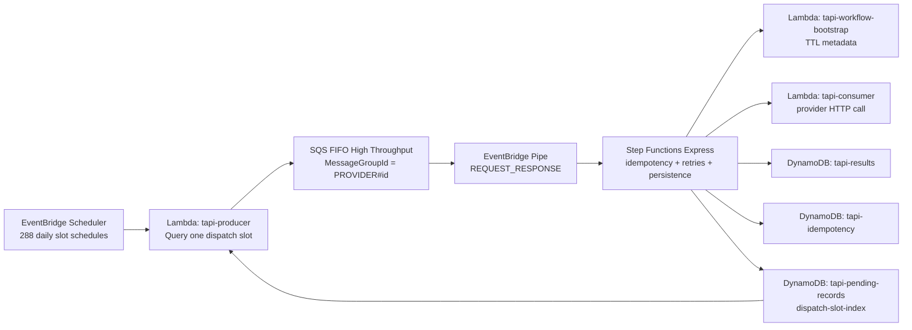

# Tapi Challenge Architecture

## Summary
The final runtime keeps the phase-3 distributed dispatch model, but closes the critical behavioral gaps found in review:
- same-provider execution remains serialized end to end
- retries are limited to transient failures
- failure persistence stores the real provider status code
- dispatch-slot metadata is owned by productive writes, not only by test seeds

## Diagram

## Key Decisions
### 1. Ordered execution by provider
`SQS FIFO -> EventBridge Pipe -> Step Functions Express (REQUEST_RESPONSE)` keeps one same-provider message in flight until the workflow closes. This removes the old gap where `StartExecution` acknowledged the queue too early.

### 2. Retry semantics
The workflow retries only `TransientApiError` and `States.Timeout` with exponential backoff and full jitter. `TerminalApiError` goes directly to final failure persistence.

### 3. Failure audit fidelity
The consumer throws classified errors whose message is a JSON payload containing the real `statusCode`, `message`, and `category`. The workflow parses that payload and persists the real provider status code instead of fixed placeholders.

### 4. Productive slot ownership
Pending-record writers compute `dispatchSlot`, `dispatchSlotPk`, and `dispatchSortKey` at write time using the stable hash of `recordId + providerId + scheduledDate`.

## Traceability
| Challenge requirement | Solution |
|---|---|
| Realizar una consulta diaria distribuida a lo largo del día | `EventBridge Scheduler` creates 288 slot schedules and `tapi-producer` queries one dispatch partition per run. |
| Guardar el resultado de la consulta en base de datos | `Step Functions Express` persists success and failure results in `tapi-results`. |
| Manejo de errores reintentables y no reintentables | `TransientApiError` is retried with jitter; `TerminalApiError` is fail-fast. |
| Evitar concurrencia a un mismo proveedor | `MessageGroupId = PROVIDER#<providerId>` plus synchronous `EventBridge Pipe` into the workflow preserves end-to-end serialization. |
| Escalar a 1 millón de registros | `dispatch-slot-index` partitions daily work into 288 isolated windows, avoiding monolithic reads. |

## Local Proof Points
- CDK tests verify `AWS::Pipes::Pipe`, Express workflow type, and the absence of Lambda event source mapping from the provider queue.
- State machine tests verify strict retry/catch semantics and dynamic failure parsing.
- Producer tests verify slot-based query access and provider-based FIFO grouping.
